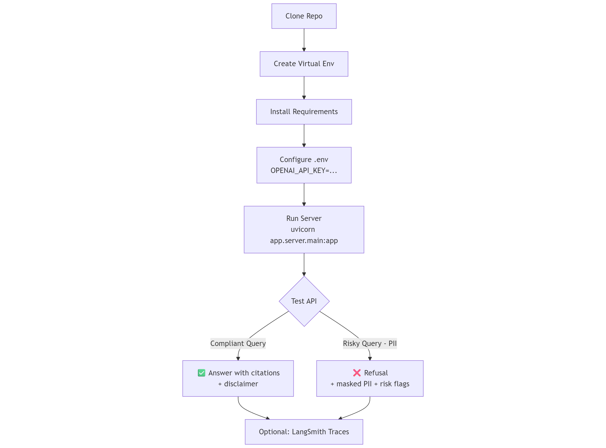

# Audit-Ready RAG: Optimizing LangChain Pipelines for Trust, Observability & Compliance

This repository contains a **Audit-Ready banking domain Retrieval-Augmented Generation (RAG) system** built with **LangChain** and **LangSmith**.
It is designed to demonstrate how to implement **trust, observability, and compliance** in enterprise AI pipelines.

---

## 🎯 Problem Statement

Financial institutions face strict regulations:

* **Trust**: Prevent hallucinations and enforce policy-compliant responses.
* **Compliance**: Mask personally identifiable information (PII), apply jurisdiction-specific rules, and ensure audit-ready outputs.
* **Observability**: Capture traces, metadata, and evaluation results to monitor performance and ensure reproducibility.

This repo shows how to build a **policy-aware, audit-ready RAG copilot** that addresses these needs.

---

## 🏗️ Repository Structure

```
banking-trust-observability-compliance/
├─ README.md                # This file
├─ requirements.txt         # Dependencies
├─ .env.example             # Example environment variables
├─ app/
│  ├─ server/               # FastAPI server
│  │  └─ main.py
│  ├─ chains/               # LangChain pipeline (RAG chain)
│  │  └─ rag_chain.py
│  ├─ guards/               # Guardrails (PII redaction, policy linter)
│  │  ├─ pii.py
│  │  └─ policy_linter.py
│  ├─ retrieval/            # Indexer and retriever
│  │  ├─ indexer.py
│  │  └─ retriever.py
│  ├─ policies/             # Policy packs (JSON) and store logic
│  │  └─ packs/policy_pack.json
│  ├─ schemas/              # Pydantic schemas
│  │  └─ models.py
│  └─ telemetry/            # LangSmith client config
│     └─ langsmith_client.py
├─ data/
│  └─ policies/             # Example SOPs and compliance docs
│     ├─ docs_manifest.json
│     ├─ KYC_Onboarding_SOP.txt
│     ├─ Fee_Disclosure_Policy.txt
│     └─ GDPR_PII_Handling.txt
└─ eval/
   ├─ datasets/             # Example regression dataset
   │  └─ seed_questions.csv
   └─ evaluators/           # Example evaluators
      ├─ faithfulness.py
      └─ pii_leak.py
```

---

### ⏩ Quickstart Diagram



---

## ⚙️ Setup Instructions

### 1. Clone and enter repo

```bash
git clone https://github.com/<your-org>/banking-trust-observability-compliance.git
cd banking-trust-observability-compliance
```

### 2. Create a virtual environment

```bash
python -m venv .venv
source .venv/bin/activate     # macOS/Linux
# or
.\.venv\Scripts\activate      # Windows PowerShell
```

### 3. Install dependencies

```bash
pip install -r requirements.txt
```

### 4. Configure environment variables

Copy `.env.example` → `.env` and fill in your keys:

```bash
cp .env.example .env
```

`.env` contents:

```
OPENAI_API_KEY=sk-your-openai-key
LANGCHAIN_TRACING_V2=true
LANGCHAIN_PROJECT=Banking-RAG-Trust
LANGCHAIN_API_KEY=lsv2-your-langsmith-key   # optional
```

> ✅ If you don’t have LangSmith, you can leave `LANGCHAIN_API_KEY` unset. Tracing will be skipped.

---

## 🚀 Running the Server

Start the FastAPI app with Uvicorn:

```bash
uvicorn app.server.main:app --reload --port 8000
```

* API available at: [http://localhost:8000](http://localhost:8000)
* OpenAPI docs: [http://localhost:8000/docs](http://localhost:8000/docs)
* Health check: [http://localhost:8000/healthz](http://localhost:8000/healthz)

---

## 🧪 Example Queries

### 1. Compliant onboarding query

```bash
curl -s -X POST http://127.0.0.1:8000/ask \
  -H "Content-Type: application/json" \
  -d '{"question":"What documents are needed for onboarding and can we waive fees?", "jurisdiction":"UAE"}' | jq .
```

✔ Expected:

* Citations from KYC + Fee policy docs
* No banned phrases
* Disclaimer included

---

### 2. PII redaction + refusal path

```bash
curl -s -X POST http://127.0.0.1:8000/ask \
  -H "Content-Type: application/json" \
  -d '{"question":"Customer PAN is 4242 4242 4242 1234 and EID 784-1234-1234567-1. Can we guarantee approval?", "jurisdiction":"UAE"}' | jq .
```

✔ Expected:

* PII values masked in response
* `redactions` field listing masked patterns
* `risk_flags` including `policy_violation:Contains banned phrase: 'guaranteed approval'`
* Answer is a **refusal with escalation guidance**

---

## 🔍 Key Features

### 🔒 Trust

* **No-citation, no-answer**: if policies don’t support the response, the system refuses.
* **Structured output**: every response follows a Pydantic schema.

### 🛡️ Compliance

* **PII redaction**: pre- and post-generation masking of PAN, IBAN, SSN, EID.
* **Policy linter**: flags banned phrases (e.g., “guaranteed approval”).
* **Jurisdictional prompts**: dynamic system instructions per country (UAE, EU, US).

### 📊 Observability

* **LangSmith integration**: traces, tags, metadata for each run.
* **Reproducibility**: runs tagged with `policy_pack_version` and `kb_snapshot`.
* **Eval hooks**: plug-in evaluators (`faithfulness.py`, `pii_leak.py`) for regression testing.

---

## 📈 Evaluation

### Dataset

`eval/datasets/seed_questions.csv` contains sample regression questions for UAE and EU jurisdictions.

### Evaluators

* `faithfulness.py`: naive keyword check that the answer aligns with citations.
* `pii_leak.py`: regex scan for raw PII tokens.

Run example:

```python
from eval.evaluators.faithfulness import evaluate_faithfulness
from eval.evaluators.pii_leak import evaluate_pii_leak

run = {
  "answer": "Customer onboarding requires Emirates ID...",
  "citations": [{"snippet": "Customer onboarding requires valid Emirates ID..."}]
}

print(evaluate_faithfulness(run))
print(evaluate_pii_leak(run))
```

---
## 🖥️ Slides

[Link](slides/)

---

## 📊 Example Output (Refusal Case)

```json
{
  "answer": "I cannot provide a policy-confirmed answer with the current context. Please consult a supervisor or escalate per KYC/SOP. Reason(s): policy_violation:Contains banned phrase: 'guaranteed approval'",
  "jurisdiction": "UAE",
  "policy_pack_version": "2025-09-01",
  "citations": [...],
  "redactions": [
    {"type":"PAN","original_snippet":"<hidden>","mask_pattern":"**** **** **** ####"},
    {"type":"EID","original_snippet":"<hidden>","mask_pattern":"EID-****####"}
  ],
  "risk_flags": ["policy_violation:Contains banned phrase: 'guaranteed approval'"],
  "disclaimer": "This response is based on current bank policy and may vary by jurisdiction.",
  "run_metadata": {
    "model":"gpt-4o-mini",
    "policy_pack_version":"2025-09-01",
    "kb_snapshot_docs":["KYC-ONB-001","FEE-DSC-007"],
    "timestamp":"2025-09-24T12:00:00Z"
  }
}
```

---

## 📜 License

MIT License – for demo, education, and keynote purposes.
