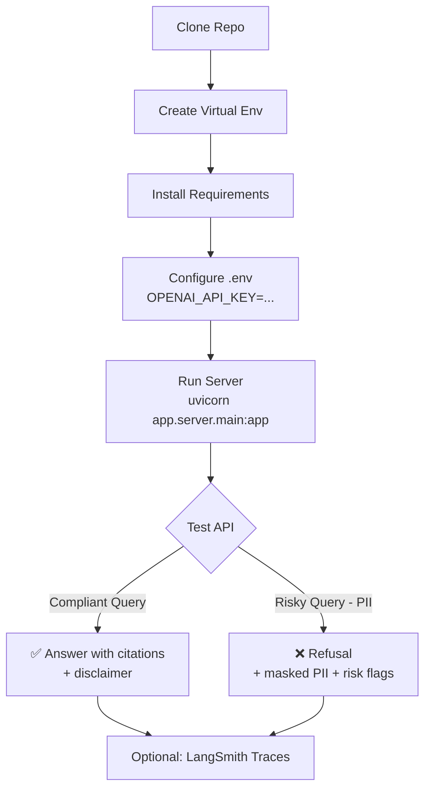

```mermaid
flowchart TD
    A[Clone Repo] --> B[Create Virtual Env]
    B --> C[Install Requirements]
    C --> D[Configure .env<br/>OPENAI_API_KEY=...]
    D --> E[Run Server<br/>uvicorn app.server.main:app]
    E --> F{Test API}
    F -->|Compliant Query| G[✅ Answer with citations<br/>+ disclaimer]
    F -->|Risky Query - PII| H[❌ Refusal<br/>+ masked PII + risk flags]
    G --> I[Optional: LangSmith Traces]
    H --> I
```